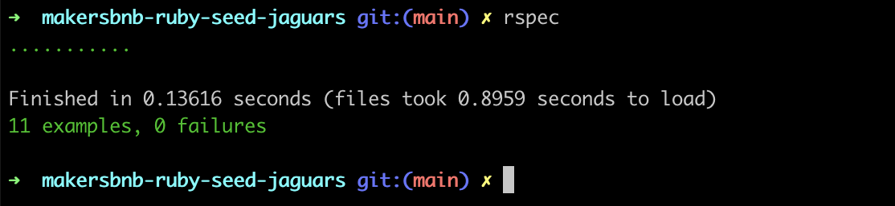
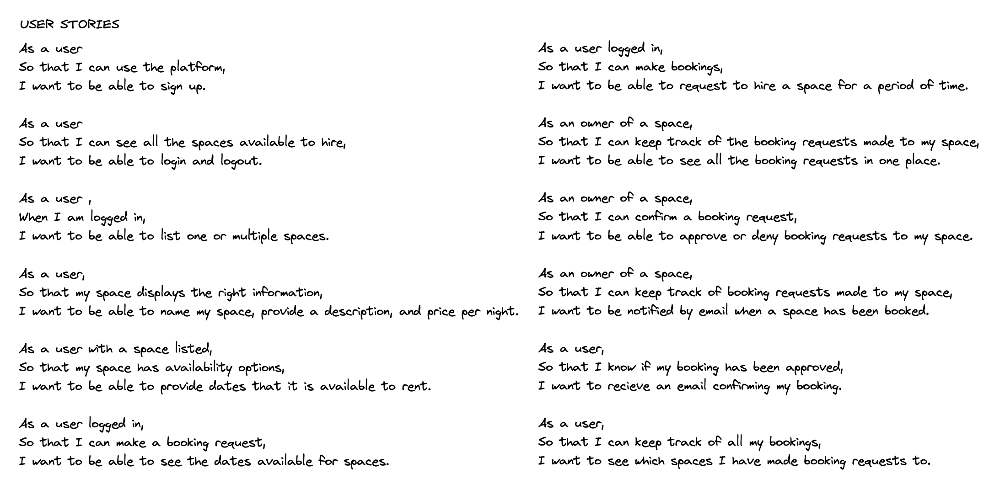
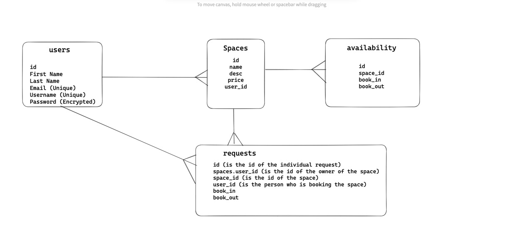

# CloudBnB

CloudBnB is an AirBnB clone, developed by a group of six students at Makers Academy as one-week engineering project.
The program is developed in Ruby, using Sinatra, and tested with RSpec. Active Records was used to set the database.

## Set up
### How to run the program

Before running this program make sure you have Ruby installed on your machine by typing in your terminal:

`ruby -v`

Otherwise you can install it by following the instructions reported [on the Ruby website](https://www.ruby-lang.org/en/documentation/installation/)

Run the server by typing:

`rackup` 

Better to do this in a separate terminal.

### Set the database

To set up the database on your local machine:

```bash
# make sure all dependencies are downloaded
bundle install

# create the databases on your machine
rake db:create

# create the tables from our migrations
rake db:migrate
rake db:migrate RACK_ENV="test"

# populate the tables with test data
rake db:seed
rake db:seed RACK_ENV="test"
```

Now if you check the tables in TablePlus you should see that the databases have been added (for both development and for test) and that the tables are now populated with dummy data.

### Tests
To run the tests you will need to install rspec on your console:

```Bash
gem install bundler
bundle add rspec
```

then you can run the tests by typing:

`rspec`

from the root directory of the project.



## Process 

We started designing our program starting from some user stories:



Then we designed our database system:



From those we started to build our MVP

## In action

Here are some screen of our final product:


<p align="center">


</p>

<!-- ## How to use

To access the database from the controller (app.rb) we can access any table as we would any object in ruby.

For example to retrieve all users as an array of objects:

```ruby
# we use the single form of the table name, which is plural (users)
users = User.all

puts users[0].id # => 1
puts users[0].username # =>'alex95'
puts users[0].firstname # => 'alex'
```

Or to return a single entry by its id:

```ruby
user = User.find(1) # will return the user with id 1
puts user.id # => 1
```

And to add to a table:

```ruby
User.create(
  username: 'alex95',
  firstname: 'Alex',
  lastname: 'Shabib',
  password: 'password',
  email: 'alex@gmail.com'
) # will just add the entry to the database

# ALTERNATIVELY

user = User.new(
  username: 'alex95',
  firstname: 'Alex',
  lastname: 'Shabib',
  password: 'password',
  email: 'alex@gmail.com'
)
# we create a new user and then save it to the database
user.save ? '/' : "Failed to add user!"
# if successful we will redirect, otherwise return a fail message
```

[This documentation](https://guides.rubyonrails.org/active_record_basics.html) is really helpful and clear and goes over all the basics methods that we might need. -->
